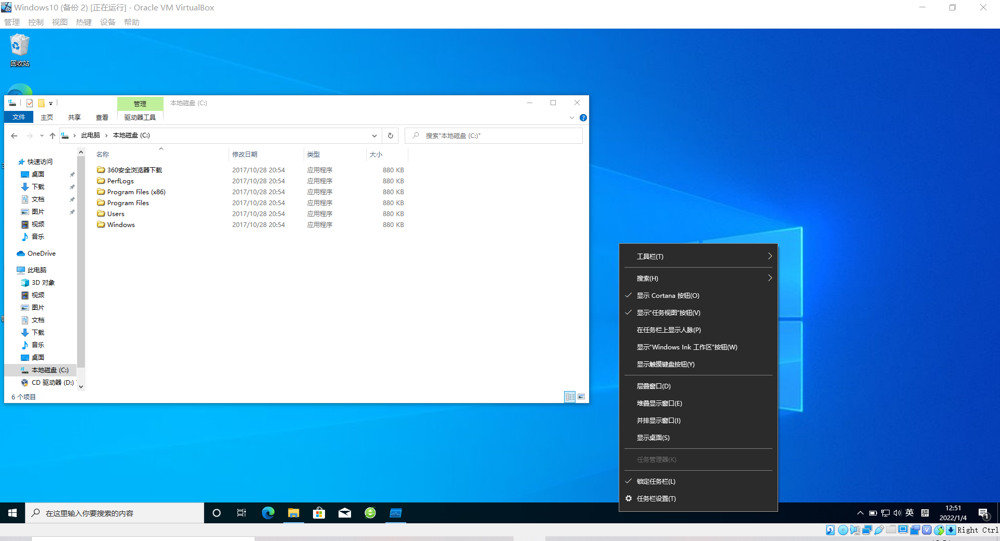

# 恶意代码分析

## 实验材料
-Process Monitor
-火绒剑
-病毒
-7.zip

## 实验过程分析
1. 在虚拟机中下载并安装Process Monitor

2. 在虚拟机中到课件网站下载脚本并备份
! [进行快照](images/1.png)

3. 关闭虚拟中的安全防护

4. 以管理员身份运行病毒

5. 病毒效果如下

6. 在 Process Monitor中选择进程分析并选中进程进行跳转
! [进程分析](images/4.png)

7. 运行火绒剑

8. 在火绒剑中找到1.exe进程

9. 在火绒剑中结束病毒进程树

10. 在启动项模块删除病毒创建的自启项目

## 启示
病毒会进行一些伪装（比如本次伪装成文件夹形式），病毒会禁止用户启用注册表页面，病毒会禁止访问任务管理器，病毒一经潜入，后患无穷。