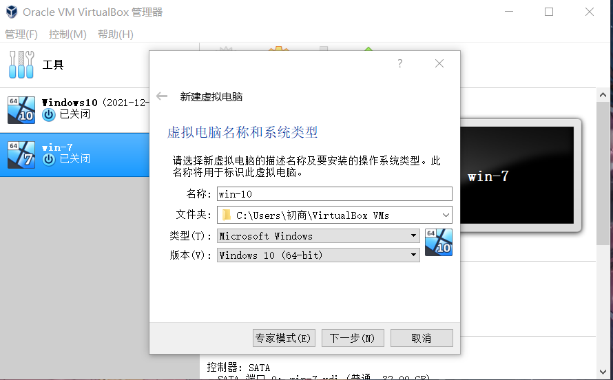
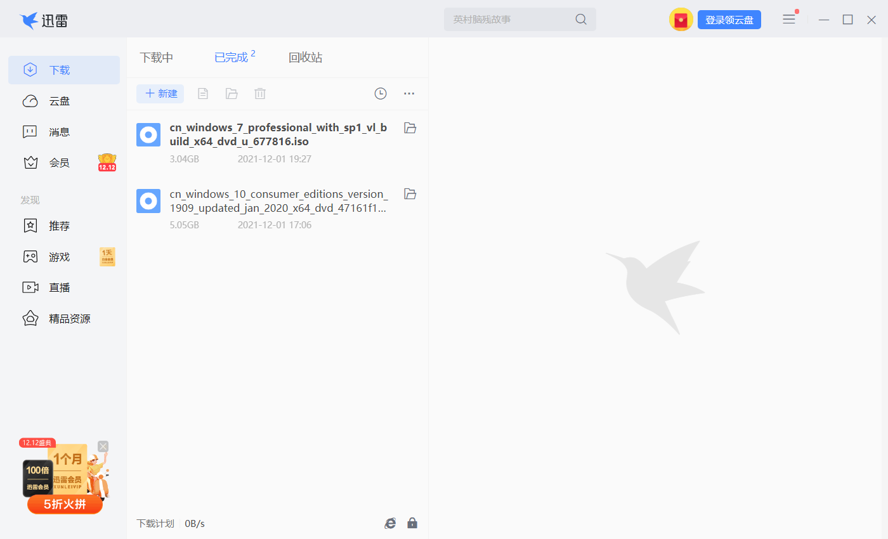
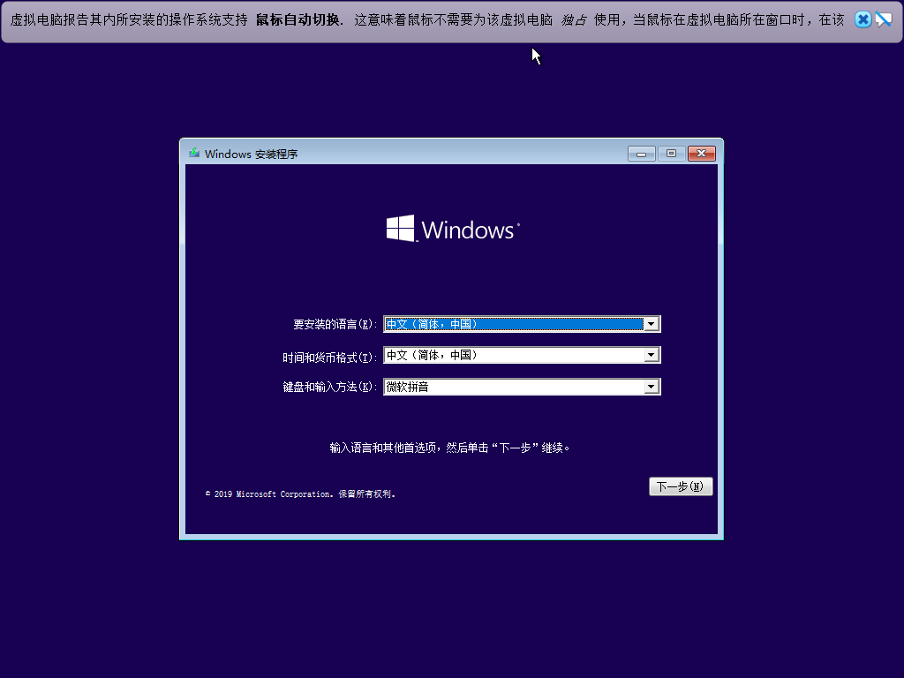
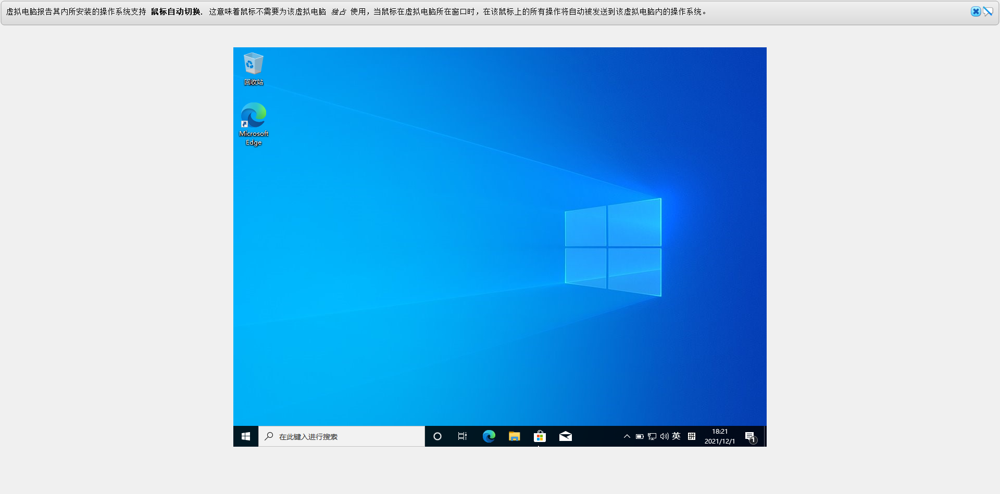
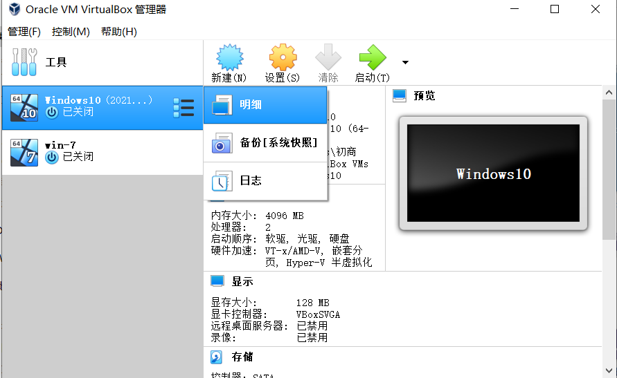

# Windows 安装实验报告

## 所需材料

- VirtualBox
- Windows 镜像

## 主要步骤

1. 安装 Virtualbox 。
2. 在Virtualbox中创建win-10系统。

3. 选择内存、创建虚拟硬盘并确定大小选择虚拟硬盘文件类型VDI，建议选择动态分配内存。
4. 在https://msdn.itellyou.cn/ 中下载最新win-10版本。

5. 启动已安装好的虚拟机，选择下载好的win-10镜像启动，重启之后即可进入装机程序。
6. 设置账户、密码并最终安装成功。

7. 安装客机增强件，实现虚拟机的收缩。
(images/安装客机增强件后.png)
8. 系统备份/生成快照。
   
   

## 总结
安装虚拟机是一个很简单的过程，也是网安专业的入门技能，对于后续的脚本的运行意义重大，能够熟练应用虚拟机对专业技能发展都是巨大的。